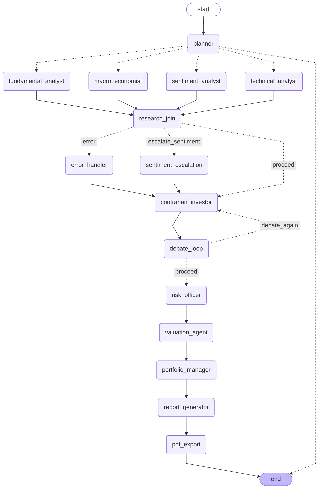

# AIRP -- Investment Pipeline Graph Diagram

> **Auto-generated** by `backend/graph/graph_visualisation.py`
> on every `build_graph()` call.  **Do not edit manually** -- your
> changes will be overwritten on the next graph compile.
>
> Generated: 2026-06-20 05:10:43 UTC

## Overview

The diagram below shows the complete AIRP LangGraph StateGraph topology
as of the most recent graph compilation.  All 12 nodes and their edges
are shown including the parallel research fan-out, the conditional routing
join, the debate loop, and the sequential tail.

Node categories:

- **planner** -- Pipeline entry point; validates state and fans out to research agents
- **fundamental_analyst, technical_analyst, sentiment_analyst,
  macro_economist** -- Four research agents; run in parallel (T-031)
- **research_join** -- Join choke-point; route_after_research fires exactly once (T-032)
- **error_handler** -- Catches failed fetch_financials; marks pipeline degraded (T-032)
- **sentiment_escalation** -- Flags severely negative news environment (T-032)
- **contrarian_investor** -- Challenges every bullish thesis; drives the debate loop
- **risk_officer, valuation_agent, portfolio_manager** -- Final analysis sequence
- **report_generator** -- Renders the Investment Memo (Markdown) from the
  Portfolio Manager's decision
- **pdf_export** -- Converts the Markdown memo to a branded PDF via
  WeasyPrint; final node before END

## Graph

## Node Count

Total nodes: 15

## Edge Notes

- Planner uses the LangGraph Send API to fan out to all 4 research agents
  **simultaneously** in the same super-step.
- All 4 research agents have **direct edges** to `research_join` (not to
  `contrarian_investor` directly) so that conditional routing fires exactly
  once after the parallel join barrier.
- The `contrarian_investor` self-loop (debate round) fires when
  `bear_conviction >= 7` and fewer than 2 debate rounds have completed.
- `error_handler` and `sentiment_escalation` both edge unconditionally to
  `contrarian_investor` after writing their state flags.
